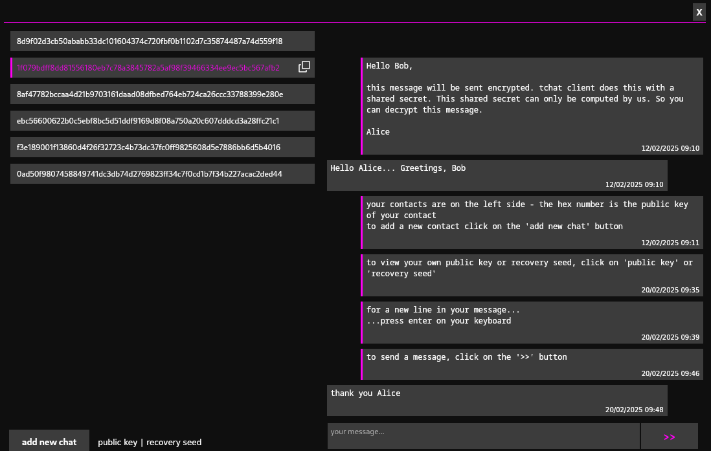

# tchat Messenger

**tchat** is a hobby privacy messenger project for Linux written in Rust. **tchat** consists of a client and an associated web-socket server. A message from client A to client B follows the path:
<p style="text-align: center;">
client A ⟶ server ⟶ client B
</p>

> [!CAUTION]
> Don't use **tchat** in sensitive or vulnerable situations!

## Notes

- The cryptography in **tchat** is not checked
- **tchat** uses "experimental-api" (for tor connection)
- This is a beginner project
- The PDF-document [Curve Ed25519 in tchat](./tchat.pdf) contains an introduction to some basic mathematics and protocols used in **tchat**
- The web-socket server based on the repo: https://github.com/zupzup/warp-websockets-example with [MIT License](./server/LICENSE)
- If you find mistakes or bad code please write an email or open an issue

## Features

- Client - server authentication by elliptic curve cryptography (ECC)
- Client: Message encryption/decryption by ECC
- Client: Integrated tor proxy server to hide the client ip address (optional)
- Client: Password encrypted ECC secret key (optional)
- Server: Messages to a client A which is not connected to the server are stored in a database and if A connects later, the server sends the stored messages to A
- TLS connection
- TOML configuration file and SQLite database for both client and server

## Setup TLS

You need openssl to generate a key and a certificate. On Debian 12 you can install openssl by

```sh
su
apt install openssl
exit
```

you can generate a self-signed certificate and key by replacing `<server_ip>` with the ip address of  the server in

```
[req]
default_bits  = 2048
distinguished_name = req_distinguished_name
req_extensions = req_ext
x509_extensions = v3_req
prompt = no

[req_distinguished_name]
countryName = XX
stateOrProvinceName = N/A
localityName = N/A
organizationName = Self-signed certificate
commonName = <server_ip>: Self-signed certificate

[req_ext]
subjectAltName = @alt_names

[v3_req]
subjectAltName = @alt_names

[alt_names]
IP.1 = <server_ip>
```

Then save this to `san.cnf` and generate `cert.pem` and `key.pem` by

```sh
openssl req -x509 -nodes -days 3650 -newkey rsa:2048 -keyout key.pem -out cert.pem -config san.cnf
```

On server device: Create the directory `~/.config/tchat/tls` and copy `cert.pem` and `key.pem` to this directory.

On client device: Create the directory `~/.config/tchat/tls` and copy `cert.pem` to this directory.

### Reference and License for 'Setup TLS'

https://github.com/antelle/generate-ip-cert

MIT License

Copyright (c) 2020 Antelle

Permission is hereby granted, free of charge, to any person obtaining a copy
of this software and associated documentation files (the "Software"), to deal
in the Software without restriction, including without limitation the rights
to use, copy, modify, merge, publish, distribute, sublicense, and/or sell
copies of the Software, and to permit persons to whom the Software is
furnished to do so, subject to the following conditions:

The above copyright notice and this permission notice shall be included in all
copies or substantial portions of the Software.

THE SOFTWARE IS PROVIDED "AS IS", WITHOUT WARRANTY OF ANY KIND, EXPRESS OR
IMPLIED, INCLUDING BUT NOT LIMITED TO THE WARRANTIES OF MERCHANTABILITY,
FITNESS FOR A PARTICULAR PURPOSE AND NONINFRINGEMENT. IN NO EVENT SHALL THE
AUTHORS OR COPYRIGHT HOLDERS BE LIABLE FOR ANY CLAIM, DAMAGES OR OTHER
LIABILITY, WHETHER IN AN ACTION OF CONTRACT, TORT OR OTHERWISE, ARISING FROM,
OUT OF OR IN CONNECTION WITH THE SOFTWARE OR THE USE OR OTHER DEALINGS IN THE
SOFTWARE.

## Install

### Building on Debian 12

- Install Rust on server and client device:

```sh
su
apt install curl build-essential
exit
curl --proto '=https' --tlsv1.2 -sSf https://sh.rustup.rs | sh
```

If Rust is already installed: My Rust version is **1.84.1**

- Run the server:

```sh
su
apt install libssl-dev pkg-config
exit
```

then

```sh
git clone https://github.com/tworks-main/tchat
cd tchat
cargo run -p server
```

- Run the client:

```sh
su
apt install libwebkit2gtk-4.1-dev libgtk-3-dev libayatana-appindicator3-dev libxdo-dev libssl-dev pkg-config
exit
```

then

```sh
git clone https://github.com/tworks-main/tchat
cd tchat
cargo run -p client
```


- Generating updated Appimages:

If you change the code and want an updated appimage: https://crates.io/crates/cargo-appimage and note running

```sh
cargo appimage
```

in `/path/tchat/client` or `/path/tchat/server`. Then you find the generated appimage in `/path/tchat/target/appimage`.

### Building on other Linux Distributions

For the clients Rust crate Dioxus:
https://dioxuslabs.com/learn/0.6/getting_started/#linux

For the remaining Rust crates read the documentations. 

### Install Appimage on Linux 

Download the appimages from the [releases](https://github.com/tworks-main/tchat/releases/latest), make it executable

```sh
chmod a+x client.AppImage
```

and run

```sh
./client.AppImage
```

## Configuration

### Client

- Client connection to server via
	- Tor
	- Clearnet
- Server
	- Ip address (v4 or v6) and port
- Secret key encryption
	- Password encryption of the secret key
	- No password encryption of the secret key

You configure the client at the first start of the client. The configuration is then saved in `~/.config/tchat/client.toml`. To change the settings in the future, simply change or remove `client.toml`.

### Server

You enter the servers public ip address (v4 or v6) and the port of the server at the first start. The configuration is then saved in `~/.config/tchat/server.toml`. To change the settings in the future, simply change or remove `server.toml`.

## Roadmap

- [ ] Error handling
- [ ] Commenting code base
- [ ] Reduce the client appimage file size
- [ ] Received message notification in gui
- [ ] Delete messages and chats from gui
- [ ] Implement hashcash to prevent spam

## License

[MIT License](./LICENSE)


